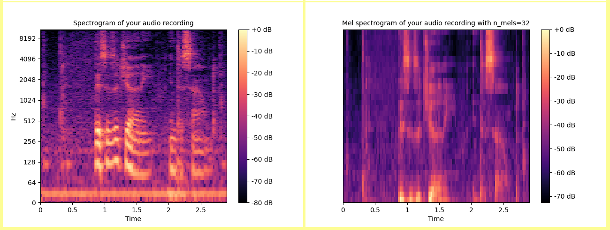

# Speech Sound Visualiser

Speech Sound Visualiser is a Heroku Flask app that generates and displays a raw waveform plot, spectrum plot, and regular and mel spectrographs of a speech sound that you record.

## How to use it

Go to the [Heroku app page](https://speech-sound-visualiser.herokuapp.com/) and follow the instructions on the page.

<a href="https://speech-sound-visualiser.herokuapp.com/"></img></a>

## Example output

<a href="https://speech-sound-visualiser.herokuapp.com/"></img></a>
<a href="https://speech-sound-visualiser.herokuapp.com/"></img></a>

## How it works

I wrote the code for analysing the sound file and generating the visualisations in Python using the [librosa](https://pypi.org/project/librosa/) and [matplotlib](https://pypi.org/project/matplotlib/) libraries. The parameters and options selected at each stage are chosen to most closely model those used for processing of speech sounds for automatic speech recognition as described in Juraskfy and Martin (2021, pp. 556-560) and various online sources included in the comments of the [Python module](app/visualiser/main.py).

The audio data is sent via a POST request to the Flask app, which saves image files of the visualisations to the static/images folder and sends back the hypothesis transcription from the Google Web Speech API, which is displayed along with the images by the page upon receipt.

## Credits

- The Python [SpeechRecognition](https://pypi.org/project/SpeechRecognition/) library is used to interface with the Google Web Speech API.
- Matt Diamond's [Recorderjs](https://github.com/mattdiamond/Recorderjs) plugin is used to record and export audio.
- https://medium.com/analytics-vidhya/understanding-the-mel-spectrogram-fca2afa2ce53 was a VERY useful resource when getting to understand the various processing stages and how to implement them using librosa.

## References

Jurafsky, D. and Martin J. H. (2021), Speech and language processing. 3rd edn draft. Available at: https://web.stanford.edu/~jurafsky/slp3/ed3book_sep212021.pdf (Accessed 22 December 2021). 
